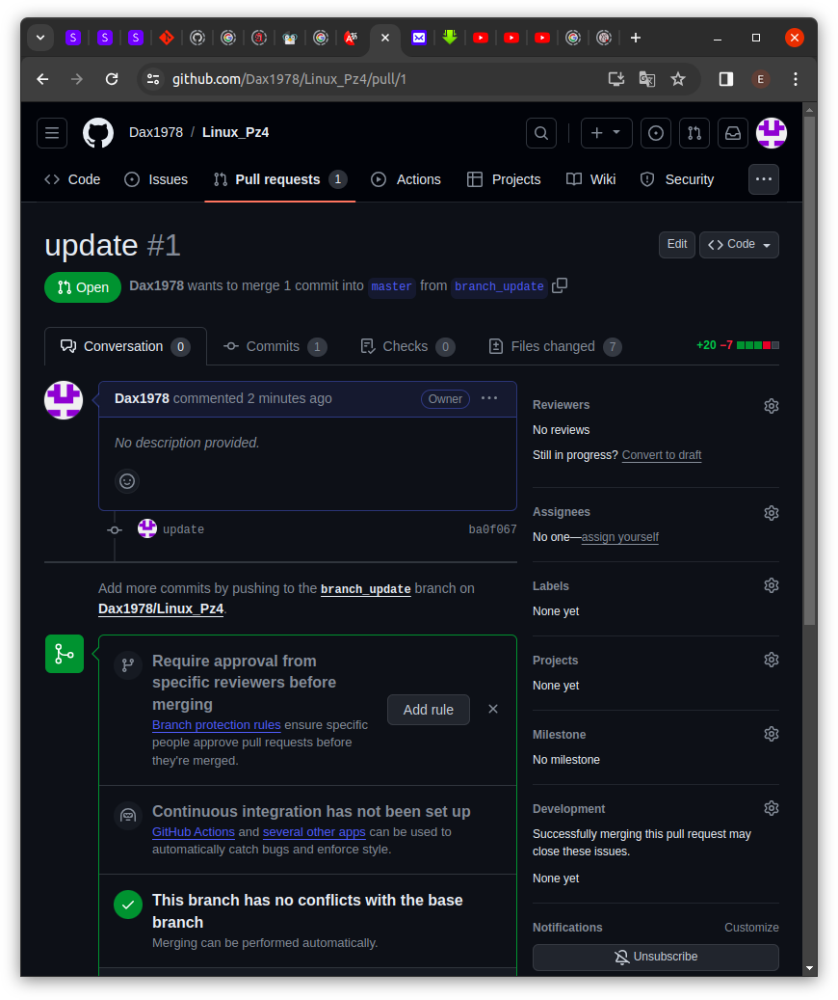
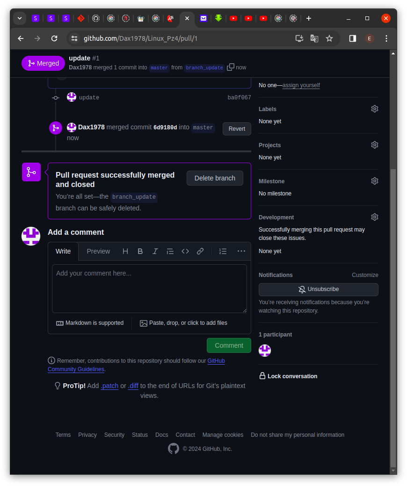

# Работа с Git и GitHub

## Мои шаги выполнения задачи
1. Создал Git-репозитарий для Практического задания 4 ***Linux_Pz4*** в GitHub 
    

2. Клонирую созданный репозиторий в папку с Практическим заданием 4 
    `git clone git@github.com:Dax1978/Linux_Pz4.git` 
    

3. В каталоге репозитория создаю *README.md* и *test.py* 
    

4. Сохраняю изменения в репозитории 
     

5. Отправляю изменения в GitHub 
    

6. И что же там на GitHub 
    

7. Создаю новую ветку для внесения улучшений 
    

8. Вношу изменения в *test.py* 
    

9. Сохраняю изменения и отправляю их в GitHub 
    

10. Создаю pull-request 
    

11. Мержу ветку в основной репозиторий 
    

12. Теперь если в локальном репозитории перейти в ветку ***master***, то мы вернемся в состояние репозитория до обновлений. Соответственно, что бы получить все обновления, надо получить смерженную ветку **master с удаленного репозитория 
