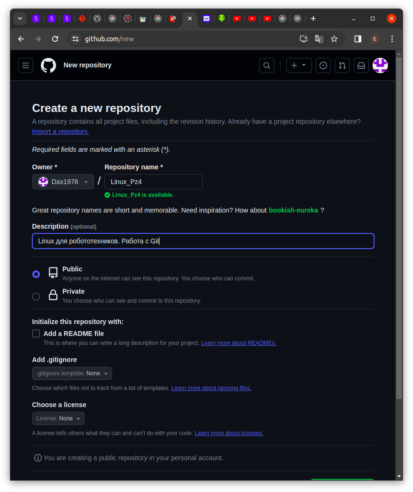
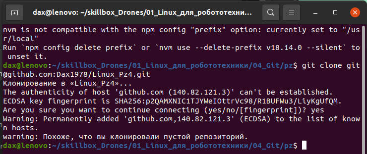
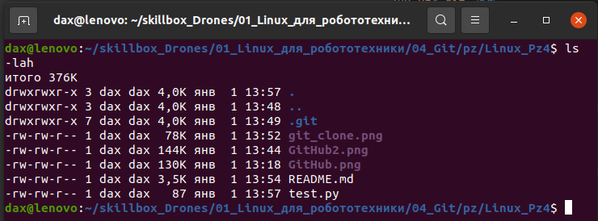
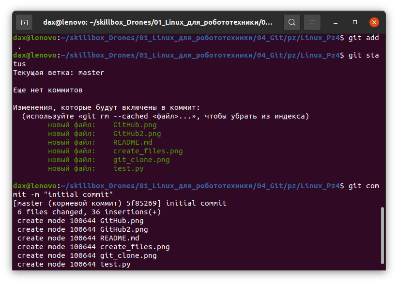
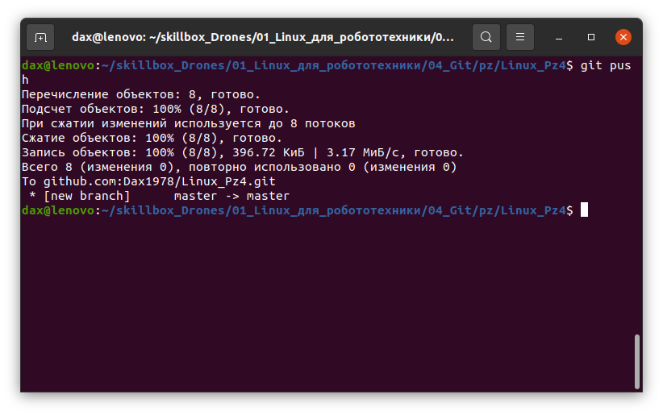
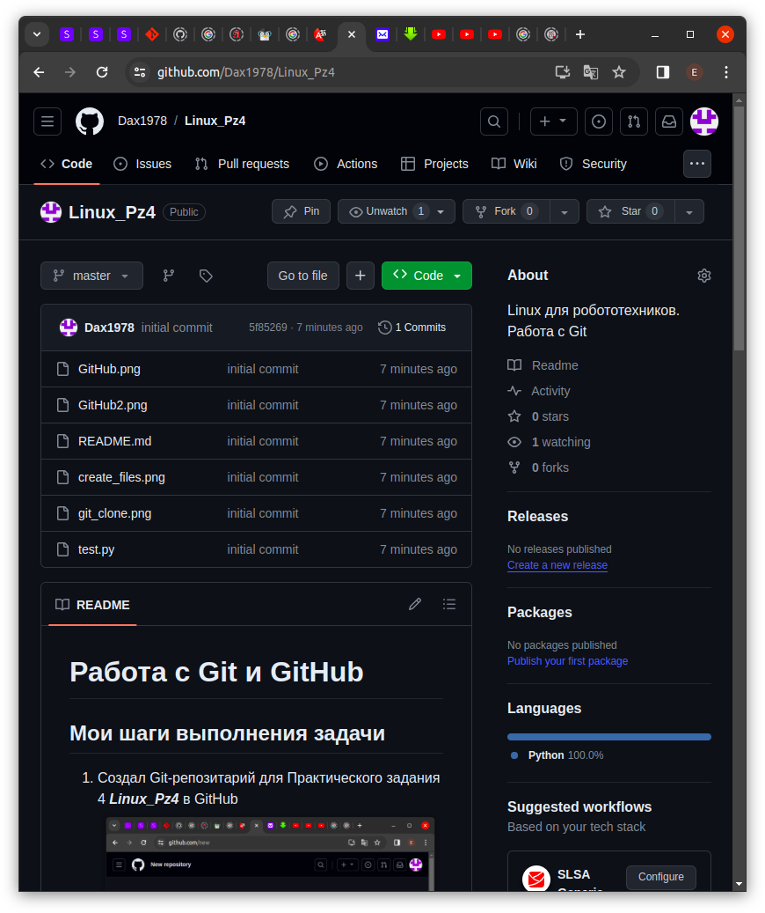
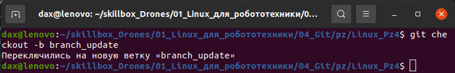
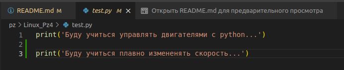
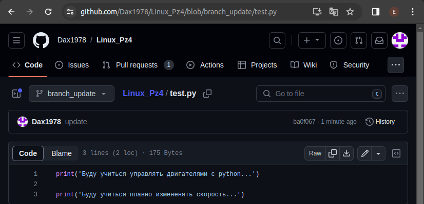

# Работа с Git и GitHub

## Мои шаги выполнения задачи
1. Создал Git-репозитарий для Практического задания 4 ***Linux_Pz4*** в GitHub 
    

2. Клонирую созданный репозиторий в папку с Практическим заданием 4 
    `git clone git@github.com:Dax1978/Linux_Pz4.git` 
    

3. В каталоге репозитория создаю *README.md* и *test.py* 
    

4. Сохраняю изменения в репозитории 
     

5. Отправляю изменения в GitHub 
    

6. И что же там на GitHub 
    

7. Создаю новую ветку для внесения улучшений 
    

8. Вношу изменения в *test.py* 
    

9. Сохраняю изменения и отправляю их в GitHub 
    

Сохраните внесённые улучшения в репозитории.
Создайте пул-реквест для слияния изменений с основной веткой (на GitHub/GitLab).
Опционально: дождитесь ревью кода от куратора и внесите необходимые правки, если потребуется.
Закройте пул-реквест и завершите слияние изменений с основной веткой.
Оформите краткий отчёт в файле README.md в Git-репозитории. Отчёт должен содержать следующие разделы:
Общее описание проекта RobotMotorsControl: кратко изложите цель и назначение проекта.
Описание работы с Git:
Создание и клонирование репозитория: опишите, как был создан и склонирован репозиторий.
Процесс сохранения изменений: опишите последовательность команд для добавления, фиксации и отправки изменений.
Взаимодействие с ветками: опишите, как создавались, изменялись и сливались ветки в вашем репозитории.
Пул-реквесты: опишите, какие пул-реквесты были созданы, каким был процесс ревью и какие изменения были предложены и применены (если таковые были).
Основные изменения и улучшения в коде: кратко опишите ключевые добавленные или модифицированные функции и их назначение.
Заключение: изложите впечатления от работы с Git, а также возможные планы или предложения по дальнейшему улучшению проекта и взаимодействию с Git.